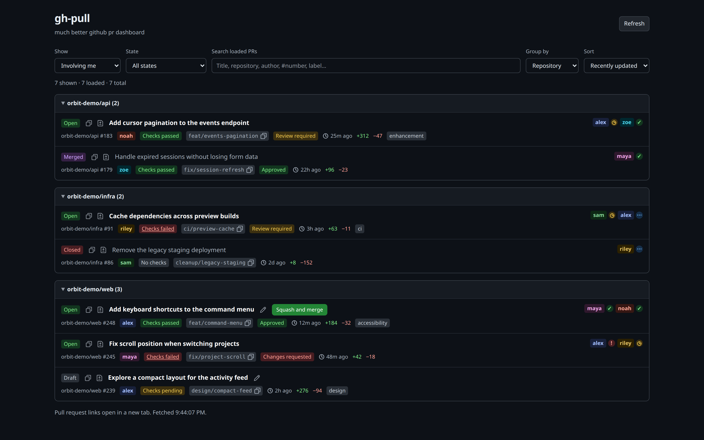

#  gh-pull

much better github pr dashboard

A fast GitHub pull request dashboard with two authentication modes: use your existing GitHub CLI login locally, or sign in through a GitHub App. Both modes share the same UI and PR actions.

**[Open the hosted dashboard](https://gh-pull.up.railway.app/)** and sign in with GitHub—no local setup required.

If you can't get your organization's approval for the hosted GitHub App, you can [host it yourself in local mode](#local-mode) using your existing GitHub CLI login or a personal access token with access to your repositories. Your organization's token and SSO policies still apply.

Plain JavaScript, native browser controls, and a Node server. No runtime dependencies or build step. A **GitHub.com** account is required; running it yourself also requires **Node.js 22+**.



## Local mode

```sh
gh auth login
npm start
```

Open <http://localhost:3000>. Local mode is the default (`AUTH_MODE=local`). The server uses your GitHub CLI credentials, or `GH_TOKEN` / `GITHUB_TOKEN` if supplied. It binds only to `127.0.0.1`; credentials stay on the server.

`npm start` and `npm run dev` restart the server when backend files change. Reload the browser after frontend edits. Use `node server.js` to run without automatic restarts.

## GitHub App mode

Users select **Sign in with GitHub** and authorize the app. Each session has its own GitHub client and PR cache. This mode never uses the server owner's GitHub CLI credentials or personal token.

Register a [GitHub App](https://github.com/settings/apps/new) with its user authorization callback set to `PUBLIC_URL/auth/callback`. For local development, use `http://localhost:3000/auth/callback`. Create a client secret and configure the app:

```sh
cp .env.example .env
# Set AUTH_MODE=github-app and fill in the GitHub App settings in .env.
node --env-file=.env server.js
```

`.env` is ignored by Git. `npm start` reads environment variables already set in your shell; it does not load `.env` automatically.

Repository permissions for the full feature set:

| Permission | Access | Purpose |
| --- | --- | --- |
| Pull requests | Read and write | View PRs, edit titles, change draft status |
| Contents | Read and write | Merge PRs |
| Checks | Read-only | Check results and progress |
| Commit statuses | Read-only | Commit status results |

Metadata read access is included by GitHub. Read-only Pull requests and Contents permissions can be used if write actions are not needed; GitHub rejects writes without the corresponding permission.

Keep user access token expiration enabled. Webhooks and an app private key are not needed. Leave “Request user authorization (OAuth) during installation” disabled: sign-in starts from the dashboard with browser-bound state and PKCE.

Install the app on the repositories it should access. Private repositories must be accessible to both the app and the signed-in user; organization access may require administrator approval or an active SSO session. Set the optional app slug to enable **Install GitHub App** and **Manage repository access** links. Installation and repository approval take place on GitHub; return here and refresh afterward. See [GitHub's authorization documentation](https://docs.github.com/en/apps/creating-github-apps/authenticating-with-a-github-app/generating-a-user-access-token-for-a-github-app).

## Configuration

| Variable | Default | Description |
| --- | --- | --- |
| `AUTH_MODE` | `local` | `local` or `github-app` |
| `PORT` | `3000` | Server port |
| `HOST` | `127.0.0.1` | Bind address in GitHub App mode; local mode always uses loopback |
| `GH_TOKEN` / `GITHUB_TOKEN` | GitHub CLI login | Local-mode authentication |
| `PUBLIC_URL` | — | Required in GitHub App mode; public origin without a path |
| `GITHUB_APP_CLIENT_ID` | — | Required in GitHub App mode; client ID, not app ID |
| `GITHUB_APP_CLIENT_SECRET` | — | Required in GitHub App mode; kept on the server |
| `GITHUB_APP_SLUG` | — | Optional app slug for the repository access link |

`PUBLIC_URL` requires HTTPS, except for HTTP localhost development. Its host must match incoming requests, and its `/auth/callback` URL must match the GitHub App registration. Use the same hostname throughout login; `localhost` and `127.0.0.1` are distinct.

## Features

- **Views and filters:** Created by me, Involving me, and Review requested; open (including drafts), merged, closed, or all PRs. Filters are shareable through the URL.
- **Search and grouping:** Search loaded PRs by title, repository, author, number, or label. Group by repository, author, status, or checks; collapse groups and sort by creation or update time.
- **PR details:** Authors, reviewers, review decisions, labels, changed-line counts, source branches, and update times. Authors and reviewers have consistent colors saved in this browser.
- **Check progress:** Pending badges show passed/total counts, such as **Checks pending · 1/8**. Only successful checks count as passed; skipped and neutral checks do not. Failed-check badges link to GitHub's checks page.
- **Background refresh:** Refreshes 60 seconds after each load finishes. The circular refresh icon shows the countdown in its center and tooltip, and spins while fetching, with the button disabled until the request finishes. Existing PRs stay visible until fresh data arrives, including when a refresh fails.
- **Viewed tracking:** New updates have brighter, bolder titles. Opening a PR, diff, or checks link marks the displayed update as viewed. Newer updates highlight it again; tracking is per GitHub account and synchronized across dashboard tabs.
- **Quick links and copying:** Open PRs, repositories, diffs, and user profiles in new tabs. Usernames keep their existing appearance and show a pointer cursor. Copy PR URLs or branch names with confirmation feedback.
- **Feedback:** Use **report an issue** in the footer to open this repository's GitHub issue form.
- **Appearance:** Responsive layout, keyboard-accessible controls, and system light/dark colors.

### PR actions

Actions apply to your own PRs and require GitHub write permissions:

- **Edit a title:** Select the pencil icon. Save or Enter submits; Cancel or Escape discards. Titles must be 1–256 characters on one line. Failed saves retain the draft, and the server checks whether the title changed on GitHub before updating it.
- **Change draft status:** Select **Open** to convert a PR to draft, or **Draft** to mark it ready for review. A tooltip explains the action on hover. The badge changes after GitHub confirms, and merge readiness is rechecked automatically.
- **Merge:** Eligible PRs show a button with the repository's preferred merge method. The server rechecks permissions and readiness and pins the merge to the displayed commit. Drafts, blocked PRs, merge queues, and stacked PRs do not show this action. In GitHub App mode, a mergeable PR keeps a disabled merge button when installation access or Contents write permission is missing, with a tooltip and an installation/access link when available. Access is checked again before merging. Local mode skips installation checks.

If GitHub is still calculating mergeability, the dashboard rechecks in the background every two seconds, up to five times, without resetting loaded pages. The regular one-minute refresh continues afterward.

## Data and sessions

PRs load in pages of 50, with a 30-second server cache. Manual and automatic refresh bypass the cache and reset pagination on success. Search and grouping apply to loaded pages. Created-by-me pagination covers the full authored history; the other views use GitHub search and expose at most 1,000 matches, with a notice when that limit applies.

Labels include the first ten per PR. Reviewers include up to 100 review requests and 100 latest reviews, with a GitHub link when more exist. Check status and counts describe the latest commit's check runs and commit statuses.

Browser storage holds name colors and account-specific viewed PR IDs/timestamps, not PR contents or credentials. Without browser storage, tracking lasts only for the current page. Reading PRs directly on GitHub does not mark them as viewed here.

GitHub App tokens remain on the server; the browser receives an opaque HttpOnly session cookie, marked Secure for HTTPS. Sessions last up to seven days, and expiring GitHub tokens refresh automatically. Sign out ends the dashboard session; app authorization can be revoked separately in GitHub settings.

Sessions, login attempts, and caches are held in memory in a single server process. Restarting ends sessions. A shared session store would be needed for multiple server instances. GitHub Enterprise hosts are not supported.

## Verify

```sh
npm run check
npm test
```

Tests use Node's built-in test runner and mocked GitHub responses. They cover PR behavior, authentication, token refresh, session isolation, and request validation without credentials or network access.
